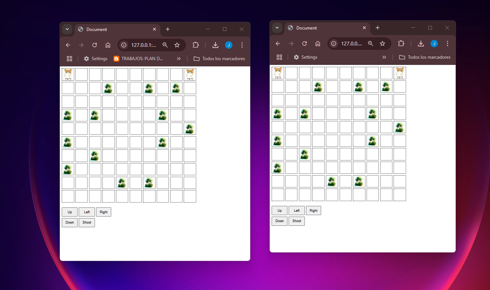
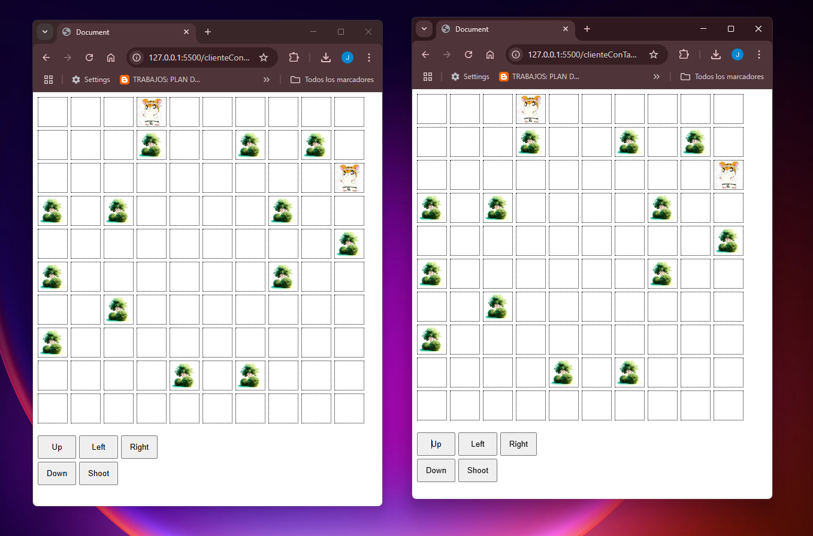
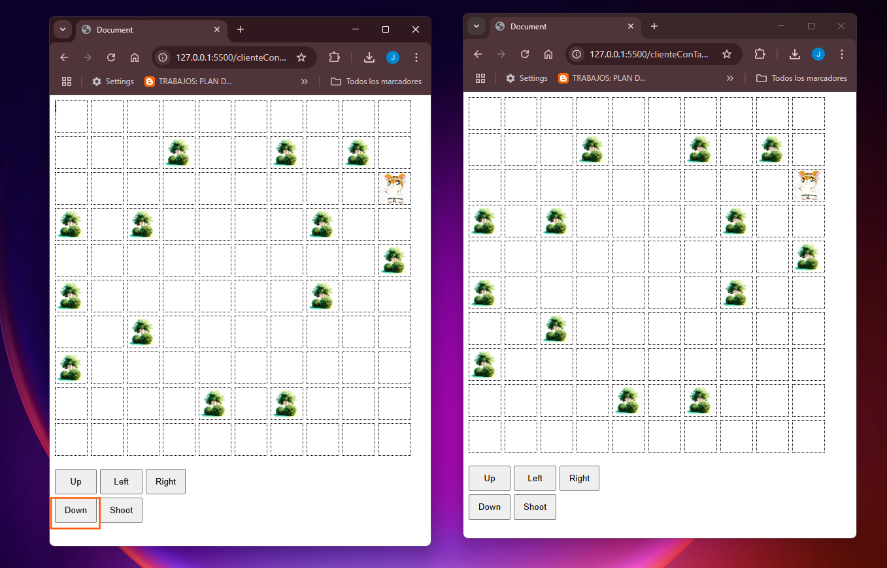

# Tamagotchi con WebSockets

Este proyecto es un Tamagotchi interactivo que se mueve dentro de una cuadrícula y guarda su posición en tiempo real utilizando WebSockets.  
Permite la sincronización entre múltiples clientes para que cada jugador vea los cambios en la posición del Tamagotchi.

## Tecnologías utilizadas

- **Frontend**: JavaScript, HTML, CSS
- **Backend**: TypeScript, Node.js, Express
- **Comunicación en tiempo real**: Socket.io 

## Pasos de instalación

### Clona este repositorio:
```bash
git clone https://github.com/Jenny-Vasquez/Tamagochi.git
```

### Instala las dependencias:
```bash
npm install
```

### Ejecuta el servidor de WebSockets:
```bash
npm run dev
```

### Abre el proyecto en el navegador:
Accede a [http://127.0.0.1:3000](http://127.0.0.1:3000) en tu navegador para interactuar con el Tamagotchi.

## Funcionamiento

- El Tamagotchi puede moverse en cuatro direcciones: **arriba, abajo, izquierda y derecha**.  
- Se almacena y sincroniza su posición en tiempo real utilizando **Socket.io**.  
- Múltiples usuarios pueden interactuar con el Tamagotchi al mismo tiempo y ver los cambios reflejados en sus pantallas.  
- **El tablero no se dibujará hasta que los jugadores estén en el juego.** Actualmente, está configurado para **dos jugadores**, aunque podría ampliarse para más.  
- El jugador se esconde al entrar en un arbusto, lo que permite moverse sin ser visto y sorprender al resto de jugadores.

# Funcionalidades Técnicas
  ## Flujo Inicial: Desde que el Cliente accdede hasta que se dibuja el tablero
  - Cuando el Cliente accede a la pagina del juego (index.html) se inicia el proceso de conexión y configuración del juego.
  - El cliente se conecta al Servidor, se crea una instancia en **Game controller** para inicializar el juego.
  - **GameController** establece una conexión con el servidor usando **ConnectionHandler** que se encarga de  establecer la conexión con WebSockets, cuando la coneccion es correcta el servido envia un mensaje de confirmación con el ID del jugador.
  Desde el servidor
  - **ServerService** asigna al jugador a una sala usando **RoomSertvice**, de esta forma **GameService** genera el tablero donde tendra en cuenta las posiciones del jugador y lo enviara al cliente.
- El servidor generara el tablero y los arbustos con **BoardBuilder** este enviara la información del tablero al cliente a través de WebSockets.

 - **Representación del Tablero**
El cliente recibe el **tablero** y lo dibuja mediante do_newBoard() en **GameService** y drawBoard() en **UIv1** dibuja el tablero en pantalla.
 - **Representación de los arbustos**
El cliente recibe los datos del tablero (incluyendo los arbustos), construyendo el mapa internamente con **Board.js** y dibujando el  tablero en la pantalla con **UIv1**.
 - **Representación de los Jugadores**
El cliente recibe a los **Jugadores** y los dibuja mediante do_newPlayer() en **GameService** actualiza las posiciones de los jugadores y drawPlayers() en **UIv1** coloca a los jugadores en el tablero.

Para implemtar la funcionalidad de que el jugador se esconda el momento que coindia el id contenga bush, este elemento contendra la imagen del arbusto en el mommento que cosultamos la siguiente celda contiene el arbusto, si tiene el arbusto no se dibnuja el jugador, de esta forma es como hacemos la comprobación con el id del bush
```
    /**Dibujamos el jugador, si coindice la posicion del arbol no dibuja al jugador */
    UIv1.drawPlayers = (players, boardSize) => {
        console.log("================== Players draw ================");
        console.log(players);
        const base = document.getElementById(UIv1.uiElements.board);
        players.forEach(elm => {
            const index = elm.x * boardSize + elm.y;
            const tile = base.children[index];
            var id = (tile.getAttribute("id") !== null) ? tile.getAttribute("id").split("_")[0] : "";
            if (tile) {
                if (id !== "tree") {//compruebar si hay un arbol
                    tile.style.backgroundImage = "url('assets/images/player.png')";
                    tile.style.backgroundSize = 'cover';
                }
                tile.classList.add("player");
            }
        });
    },
```

## Funcionalidad de los Botones que implentan el movimiento.

El cliente envía intrucciones al servido para moverse y disparar mediante los botones (Up, Down, Shoot) reflejados **UIv1.js**  de esya forma se emiten eventos socket.emit("movePlayer") y socket.emit("shootPlayer").
```
UIv1.drawControls = (player) => {

        const control = document.getElementById(UIv1.uiElements.control);
        control.className = 'controls';

        control.innerHTML = `
            <button id="up">Up</button>
            <button id="left">Left</button>
            <button id="right">Right</button>
            <button id="down">Down</button>              
            <button id="shoot">Shoot</button>
         `;

        document.getElementById('up').addEventListener('click', () => {
            console.log("Player " + player + " move on");
            ConnectionHandler.socket.emit("movePlayer", { direction: "up", playerID: player });
        });
        document.getElementById('down').addEventListener('click', () => {
            console.log("Player " + player + " down");
            ConnectionHandler.socket.emit("movePlayer", { direction: "down", playerID: player });
        });

        document.getElementById('right').addEventListener('click', () => {
            console.log("Player " + player + "  right");
            ConnectionHandler.socket.emit("movePlayer", { direction: "right", playerID: player });
        });

        document.getElementById('left').addEventListener('click', () => {
            console.log("Player " + player + "  left");
            ConnectionHandler.socket.emit("movePlayer", { direction: "left", playerID: player });
        });

        document.getElementById('shoot').addEventListener('click', () => {
            console.log("Player " + player + " shoots");
            ConnectionHandler.socket.emit("shootPlayer", { playerID: player });
            
        
        });


    }


```

El servidor procesara el movimiento o disparo desde **GameService.ts**  se calcula la nueva posición o elimina a un jugador si es disparado.
El servidor envíara esta actualización del estado del juego a todos los clientes mediante **ServerService.ts** y  envía la nueva información de los jugadores a todos en la sala.

Los clientes recibira la actualización y redibujara el tablero con do_newPlayer() y drawPlayers() en **UIv1.js** actualizan la vista en pantalla.

El resultado sera que los jugadores podran moverse y atacar en tiempo real sin retrasos.

## Rúbrica

## 1. Diseño del Tablero y Mecánicas de Juego

### Implementación de un tablero de tamaño NxN correctamente generado
**Dónde lo implementamos:**  
- En `BoardBuilder.ts` (servidor), donde creamos el tablero con tamaño definido (`size: 10`).
- En `Board.js` (cliente), para visualizar el tablero recibido desde el servidor.

**Cómo funciona:**  
- `BoardBuilder.ts` crea un tablero de 10x10 y coloca elementos (arbustos) aleatoriamente.
- `Board.js` en el cliente se encarga de dibujar el tablero con la función `drawBoard()`.

### Configuración inicial de los jugadores en las esquinas del tablero
**Dónde lo implementamos:**  
- En `GameService.ts`, específicamente en el método `addPlayer()`, donde se asignan jugadores a posiciones fijas en las esquinas.

**Cómo funciona:**  
- Definimos un array con las posiciones de las esquinas `{ x: 0, y: 0 }, { x: 0, y: 9 }, { x: 9, y: 0 }, { x: 9, y: 9 }`.
- Cada jugador que entra se le asignará a una de estas posiciones en orden.

### Implementación de ataques entre jugadores con reglas de distancia
**Dónde lo implementamos:**  
- En `shootPlayer(data)` en `GameService.ts` en el servidor.

**Cómo funciona:**  
- Cuando un jugador dispara, se obtiene su posición `(x, y)` y dirección (`Up`, `Down`, `Left`, `Right`).
- Se calcula la celda donde impacta el disparo. Si en esa celda hay otro jugador, se marca como `Dead` (`PlayerStates.Dead`).

### Implementación de casillas de escondite con normas de posicionamiento
**Dónde lo implementamos:**  
- En `BoardBuilder.ts` (servidor).

**Cómo funciona:**  
- Se colocan los arbustos (bush) en el tablero con una probabilidad del 20%.
- Evitamos que los arbustos aparezcan cerca de las esquinas donde comienzan los jugadores.
- En `UIv1.js`, si una casilla contiene un arbusto (5), se dibuja la imagen de un arbusto.

---

## 2. Comunicación Cliente-Servidor con WebSockets

### Configuración del servidor para manejar conexiones de clientes vía WebSockets
**Dónde lo implementamos:**  
- En `ServerService.ts`, en la función `init()`, se configura `socket.io` para la conexión entre cliente y servidor.

**Cómo funciona:**  
- El servidor escucha conexiones (`on('connection')`) y envía un mensaje de estado.
- Cada jugador recibe un ID único y es agregado al juego.

### Envío y recepción de mensajes entre cliente y servidor
**Dónde lo implementamos:**  
- En el Cliente con `ConnectionHandler.js`.
- En el Servidor con `ServerService.ts`.

**Cómo funciona:**  
- `ConnectionHandler.js` envía eventos como `movePlayer` o `shootPlayer`.
- `ServerService.ts` los recibe y ejecuta las acciones correspondientes (`movePlayer(data)` o `shootPlayer(data)`).

### Sincronización en tiempo real del estado del juego en todos los clientes conectados
**Dónde lo implementamos:**  
- En `ServerService.ts` mediante `sendMessageToRoom()`.

**Cómo funciona:**  
- Cada vez que un jugador se mueve o dispara, el estado del juego se actualiza y se envía a todos los jugadores en la misma sala.

### Manejo de desconexiones y reconexiones de jugadores sin afectar la partida
**Problema:**  
- No manejamos la reconexión de jugadores después de una desconexión.
- Si un jugador se desconecta, su estado no se guarda y podría perderse la partida.

**Cómo podríamos mejorarlo:**  
- Agregando una función en `GameService.ts` para volver a conectar un jugador con su estado anterior.

---

## 3. Implementación del Cliente y Eventos del Juego

### Representación visual dinámica del tablero y los jugadores según datos del servidor
**Dónde lo implementamos:**  
- En `UIv1.js`, en las funciones `drawBoard()` y `drawPlayers()`.

**Cómo funciona:**  
- `drawBoard()` dibuja el tablero con los arbustos en las posiciones correctas.
- `drawPlayers()` coloca a los jugadores en el tablero según sus coordenadas `(x, y)`.

### Implementación de eventos de juego: desplazamiento, rotación y disparo
**Dónde lo implementamos:**  
- En `UIv1.js`, en `drawControls()`.

**Cómo funciona:**  
- Cada botón (Up, Down, Left, Right, Shoot) emite eventos para mover o disparar.
- No logramos implementar la rotación debido a que actualmente el sistema de dirección solo cambia cuando se mueve el jugador.

### Diseño de una interfaz intuitiva para la interacción del jugador
**Dónde lo implementamos:**  
- En `index.html` y `UIv1.js`.

**Cómo funciona:**  
- `index.html` contiene un `<div>` donde generamos los controles dinámicamente.
- `UIv1.js` crea los botones de control (Up, Down, Left, Right, Shoot) y asigna eventos.
- Cuando el jugador presiona un botón, se envía un evento a través de WebSockets al servidor, que actualiza el estado del juego y lo retransmite a todos los clientes.

### Adaptabilidad del cliente a posibles rediseños o mejoras futuras
**Cómo podríamos mejorarlo:**  
- Separando la lógica de la interfaz de usuario en diferentes componentes.

---

## 4. Gestión de Salas y Control de Juego

### Implementación de salas para gestionar partidas independientes
**Dónde lo implementamos:**  
- En `RoomService.ts` se manejan las salas.

**Cómo funciona:**  
- Si una sala está vacía, se crea una nueva.
- Cuando una sala tiene dos jugadores, la partida inicia. Podemos cambiar el número de jugadores por sala (actualmente 2, pero podría llegar hasta 4).

```
import { Game } from "../../game/entities/Game";
import { Player } from "../../player/entities/Player";

export const RoomConfig = {
    maxRoomPlayers : 2
};

export interface Room {
    name : String;
    players : Player[];
    occupied: Boolean;
    game: Game |null;
}
```
### Control centralizado del estado del juego en el servidor
**Dónde lo implementamos:**  
- `GameService.ts` es el encargado de gestionar el estado global del juego en el servidor.

**Cómo funciona:**  
- Nos aseguramos de que toda la lógica del juego (posiciones de los jugadores, ataques, escondites, etc.) esté centralizada en un solo lugar.

### Compartición eficiente de datos del mapa entre todos los clientes
**Dónde lo implementamos:**  
- En `ServerService.ts`.

**Cómo funciona:**  
- Cada vez que un jugador se mueve o realiza una acción, `ServerService.ts` envía los datos a todos los jugadores en la sala.

### Manejo de finalización de partidas y asignación de ganadores
**Dónde lo implementamos:**  
- En `checkGameOver()` en `GameService.ts`.

**Cómo funciona:**  
- Esta función verifica si un jugador ha ganado la partida. Se ejecuta cada vez que un jugador es eliminado.

---

## 5. Uso de Buenas Prácticas de Programación y Patrones de Diseño

### Uso adecuado de clases, objetos JSON y patrones de diseño
**Dónde lo implementamos:**  
- `Board.ts`: Representa el manejo del tablero del juego.
- `Player.ts`: Representación de los jugadores.
- `GameService.ts`: Gestión del estado del juego.
- `Room.ts`: Administración de salas de juego.

### Uso de objetos JSON
**Dónde lo implementamos:**  
- `GameService.ts`: Almacena el estado del juego y lo convierte a JSON cuando un jugador realiza una acción y el estado debe actualizarse en todos los clientes, cuando un jugador nuevo se conecta, o cuando la partida termina.
- `ServerService.ts`: Convierte los datos a JSON antes de enviarlos al actualizar el estado del juego (función `updateGameState`), cuando un nuevo jugador se conecta (función `initializeGame`), o cuando la partida termina (función `gameOver`).

### Código modular y bien estructurado
Hemos intentado que el juego siga una estructura modular, lo que significa que cada funcionalidad esté separada en archivos independientes, facilitando el mantenimiento y escalabilidad del código.

| **Archivo**       | **Responsabilidad**                                 |
|-------------------|-----------------------------------------------------|
| `Board.ts`        | Maneja la estructura del tablero de juego.          |
| `Player.ts`       | Representa a un jugador (posición, estado, acciones). |
| `GameService.ts`  | Controla la lógica del juego y el estado global.    |
| `Room.ts`         | Gestiona las salas de juego y los jugadores dentro de ellas. |
| `ServerService.ts`| Maneja la comunicación entre servidor y clientes mediante WebSockets. |

---

## 6. Nivel Avanzado: Adaptación a Angular

### Refactorización del cliente para adaptarlo a Angular
- No hemos usado Angular.

### Implementación de servicios y componentes en Angular
- No hay estructura de Angular.


## Galeria 
  
  
  
